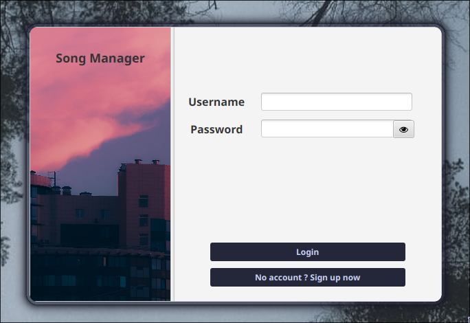
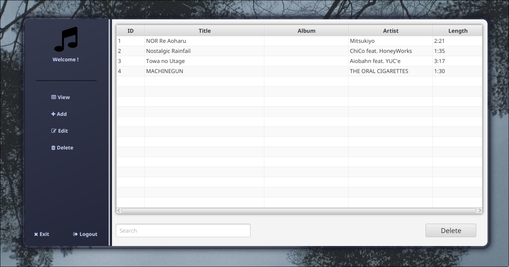

# Karaoke Song Manager

## Built with JavaFX, SceneBuilder, MySQL and Maven
- Dependencies:
  - Java 21
  - H2 Database Engine
  - Maven 3.6.3
  - Ikonli Icon Packs

### Using Maven to run the program

> .\mvnw clean install compile exec:java -Dexec.mainClass="com.javafx.application.Login"

- Or run the Login or SignUp class in your IDE

# Login screen

# Admin Panel

### Get the source code:
> git clone https://github.com/AtelierMizumi/JavaFX-Karaoke-Songs-Manager.git
- Or download zip

## Note:
- The database and the Song database will appear outside of the src